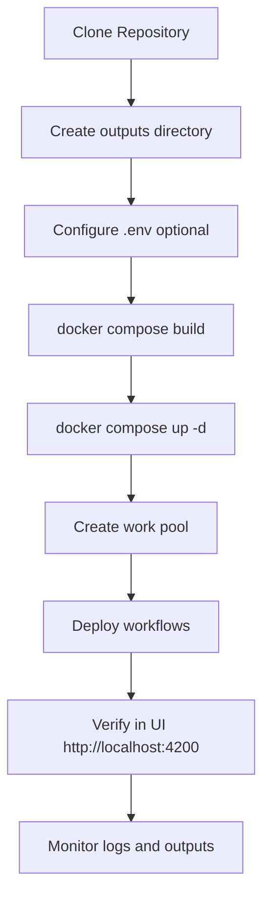

# Deployment Guide - Prefect Workflows

This guide will walk you through the step-by-step process of deploying your Prefect infrastructure with Docker.

## Prerequisites

Before starting, make sure you have installed:

- **Docker** (version 20.10 or higher)
- **Docker Compose** (version 2.0 or higher)
- **Git** (optional, for version control)

Verify the versions:

```bash
docker --version
docker compose version
```

## Data Persistence Structure

The configuration is designed to persist all important data on your local file system:

```
prefect-workflows/
├── data/
│   ├── postgres/     # PostgreSQL database (created automatically)
│   └── redis/        # Redis data (created automatically)
├── logs/
│   ├── server/       # Prefect server logs (created automatically)
│   ├── services/     # Prefect services logs (created automatically)
│   └── worker/       # Worker logs (created automatically)
├── outputs/          # Your task outputs (you must create it)
└── scripts/          # Your Python workflows
```

## Step 1: Environment Preparation

### 1.1 Create Required Directories

Create the outputs directory (the others will be created automatically):

```bash
mkdir -p outputs
```

### 1.2 Configure Environment Variables (Optional)

You can create a `.env` file in the project root to customize credentials:

```bash
cat > .env << 'EOF'
# PostgreSQL Configuration
PREFECT_POSTGRES_USER=prefect
PREFECT_POSTGRES_PASSWORD=prefect_secure_password_2024
PREFECT_POSTGRES_DB=prefect

# Timezone
TZ=America/Argentina/Buenos_Aires
EOF
```

**Security note:** Make sure `.env` is in your `.gitignore` (already configured).

## Step 2: First Installation (Initial Deployment)

### 2.1 Build the Images

Build the worker image that contains your dependencies:

```bash
docker compose build --no-cache prefect-worker
```

This process:
- Downloads the base Prefect image with Python 3.13
- Installs `uv` for dependency management
- Installs all dependencies defined in `pyproject.toml`
- Copies your Python scripts
- Configures directories and permissions

### 2.2 Start the Services

Start all services in the background:

```bash
docker compose up -d
```

### 2.3 Verify Service Status

Verify that all containers are running:

```bash
docker compose ps
```

You should see 5 services:
- `prefect-postgres` (healthy)
- `prefect-redis` (healthy)
- `prefect-server` (healthy)
- `prefect-services` (running)
- `prefect-worker` (running)

### 2.4 Check the Logs

Review the logs to ensure everything started correctly:

```bash
# View logs from all services
docker compose logs

# View logs from a specific service
docker compose logs prefect-server
docker compose logs prefect-worker

# Follow logs in real time
docker compose logs -f prefect-worker
```

## Step 3: Initial Prefect Configuration

### 3.1 Create the Work Pool

The worker needs a work pool to execute tasks. Create it by running:

```bash
docker compose exec prefect-server prefect work-pool create local-pool --type process
```

### 3.2 Verify Work Pool Creation

```bash
docker compose exec prefect-server prefect work-pool ls
```

### 3.3 Access Prefect UI

Open your browser and visit:

```
http://localhost:4200
```

You should see the Prefect UI dashboard where you can:
- Monitor flows
- View runs and logs
- Manage deployments
- Administer work pools

## Step 4: Deploy Your Workflows

### 4.1 Verify Your Scripts

Make sure your workflows are in the `scripts/` folder:

```bash
ls -la scripts/
```

### 4.2 Deploy a Workflow from the Container

Execute the deployment from inside the worker container:

```bash
docker compose exec prefect-worker python scripts/test.py
```

This command will run the `test.py` script that contains the deployment configuration with:
- Deployment name
- Work pool
- Schedule (cron)
- Tags

### 4.3 Verify the Deployment in the UI

Go to Prefect UI and:
1. Navigate to "Deployments"
2. You should see your "hello-world" deployment
3. Verify the configured schedule

## Step 5: Persistent Data Management

### 5.1 Verify Data Persistence

All this data persists on your local disk:

```bash
# View PostgreSQL data
ls -lh data/postgres/

# View Redis data
ls -lh data/redis/

# View Prefect logs
ls -lh logs/server/
ls -lh logs/worker/

# View your task outputs
ls -lh outputs/
```

### 5.2 Data Backup

To backup all your data:

```bash
# Stop services
docker compose down

# Create backup
tar -czf prefect-backup-$(date +%Y%m%d).tar.gz data/ logs/ outputs/

# Restart services
docker compose up -d
```

### 5.3 Restore from Backup

```bash
# Stop services
docker compose down

# Clean current data (CAUTION!)
rm -rf data/ logs/ outputs/

# Extract backup
tar -xzf prefect-backup-YYYYMMDD.tar.gz

# Restart services
docker compose up -d
```

## Step 6: Updates and Maintenance

### 6.1 Update Your Scripts

When you modify your scripts in the `scripts/` folder:

```bash
# Changes are reflected automatically thanks to mounted volumes
# You don't need to rebuild the image

# If you modified dependencies in pyproject.toml, rebuild:
docker compose build prefect-worker
docker compose up -d prefect-worker
```

### 6.2 Update Prefect Version

To update to a new version of Prefect:

```bash
# 1. Edit docker-compose.yml and Dockerfile
#    Change: prefecthq/prefect:3-python3.13
#    To: prefecthq/prefect:X-python3.13 (new version)

# 2. Rebuild images
docker compose build --no-cache

# 3. Stop current services
docker compose down

# 4. Start with new versions
docker compose up -d
```

### 6.3 View Resource Usage

```bash
# View CPU, memory, network usage
docker stats

# View volume disk usage
docker system df -v
```

### 6.4 Clean Old Logs

Docker logs are automatically rotated (maximum 10MB per file, 3 files). For Prefect logs:

```bash
# Clean old logs (older than 30 days)
find logs/ -name "*.log" -mtime +30 -delete
```

## Step 7: Troubleshooting

### 7.1 Services Won't Start

```bash
# View detailed logs
docker compose logs -f

# Verify ports are not in use
netstat -an | grep 4200
netstat -an | grep 5432

# Restart from scratch
docker compose down -v
docker compose up -d
```

### 7.2 Worker Can't Connect to Server

```bash
# Verify connectivity
docker compose exec prefect-worker curl http://prefect-server:4200/api/health

# Verify environment variables
docker compose exec prefect-worker env | grep PREFECT
```

### 7.3 Output Permission Issues

```bash
# Grant full permissions to outputs folder
chmod -R 777 outputs/

# Or from the container
docker compose exec prefect-worker chmod -R 777 /app/outputs
```

### 7.4 Corrupted Database

```bash
# Stop services
docker compose down

# Delete postgres data (YOU WILL LOSE YOUR DATA!)
rm -rf data/postgres/

# Restart (new DB will be created)
docker compose up -d
```

## Step 8: Useful Commands

### Container Management

```bash
# Start all services
docker compose up -d

# Stop all services
docker compose down

# Restart a specific service
docker compose restart prefect-worker

# View logs in real time
docker compose logs -f prefect-worker

# Execute command in a container
docker compose exec prefect-worker bash
```

### Prefect Management

```bash
# List work pools
docker compose exec prefect-server prefect work-pool ls

# List deployments
docker compose exec prefect-server prefect deployment ls

# View flow status
docker compose exec prefect-server prefect flow-run ls

# Run a flow manually
docker compose exec prefect-worker python scripts/test.py
```

### Cleanup

```bash
# Stop and remove containers, networks (keeps volumes)
docker compose down

# Stop and remove EVERYTHING including volumes (CAUTION!)
docker compose down -v

# Clean unused images
docker image prune -a

# Clean entire Docker system
docker system prune -a --volumes
```

## Deployment Flow Summary



## Next Steps

Once deployment is complete:

1. Read the `README.md` file to learn how to use Prefect
2. Develop your own workflows in the `scripts/` folder
3. Configure notifications and alerts in the Prefect UI
4. Explore blocks and variables in Prefect for advanced configuration

## Support

If you encounter issues:
1. Check the logs: `docker compose logs -f`
2. Review the official documentation: https://docs.prefect.io
3. Check the health checks: `docker compose ps`
